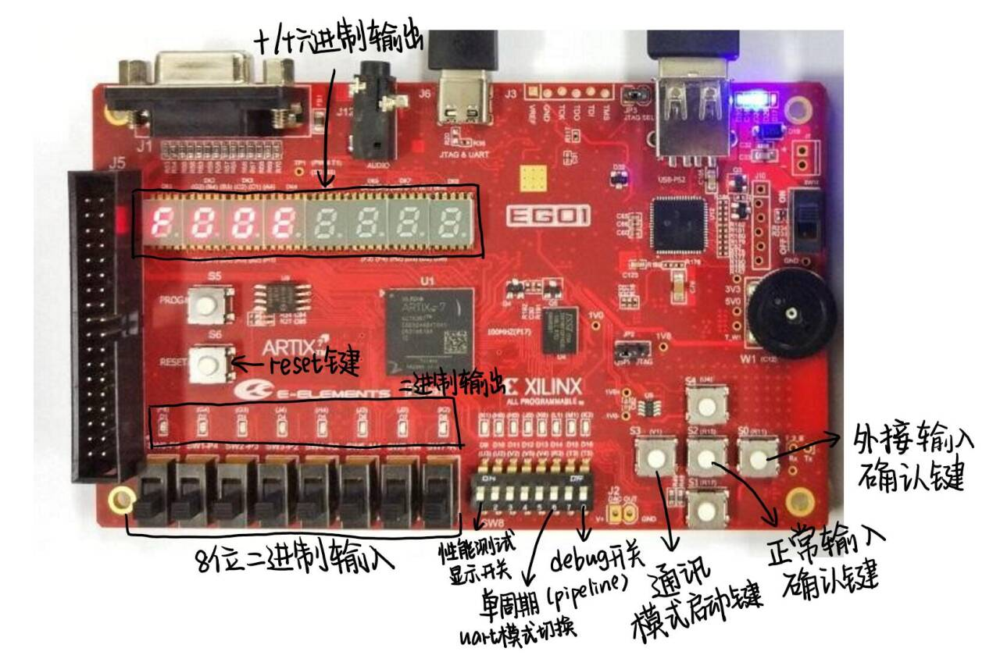
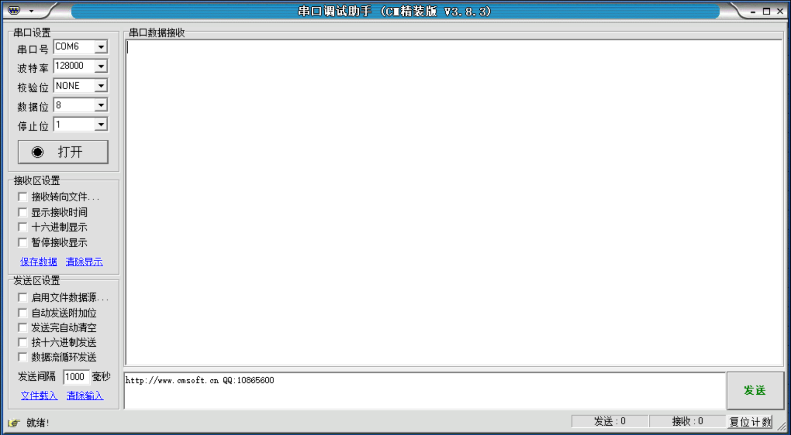
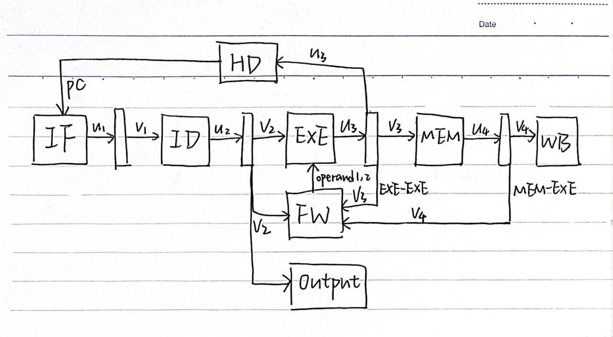
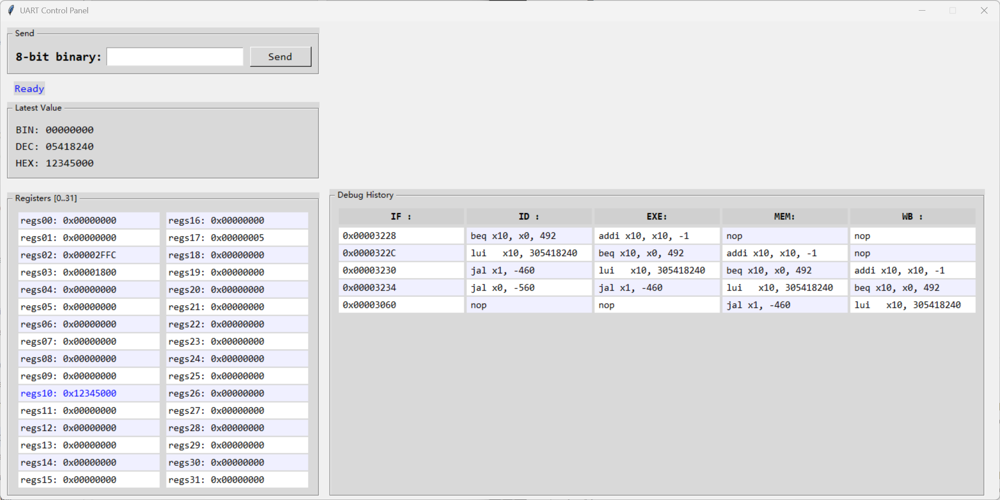

# CPU 文档

## 小组成员

|   学号   |  姓名  |                             分工                             |
| :------: | :----: | :----------------------------------------------------------: |
| 12312420 | 王振宇 | 单周期（Output/ALU）、切换测试场景、外设输入输出（前端）、 编译优化 |
| 12312505 | 江博成 | 单周期（Controller/Decoder/WBMux）、Pipeline、基本测试场景一、基本测试场景二 |
| 12311153 | 廖子韬 |            单周期（IFetch/DMem/Input）、Pipeline             |

**实验课时间：**周三 7 ~ 8 节

**贡献比：**1 : 1 : 1

## 1. 开发计划日程安排和实施情况

|    日程     |                      安排                      | 实施情况 |
| :---------: | :--------------------------------------------: | :------: |
|  5.1 ~ 5.2  |            单周期 CPU + 扩展指令集             |   完成   |
| 5.14 ~ 5.18 | Pipeline CPU + Uart 外设（键盘输入和前端显示） |   完成   |
| 5.19 ~ 5.21 |       Debug 模式（集成机器码反编译工具）       |   完成   |
| 5.22 ~ 5.25 |        Uart 切换测试场景 + 固定时钟周期        |   完成   |

## 2. CPU特性说明

- **CPU结构：**分别实现单周期 CPU 和 Pipelined CPU

- **单周期时钟周期：**25 MHz (CPU); 

- **Pipeline时钟周期：** 50 MHz (超频后 75 MHz);

- **单周期 CPI：**CPI ≈ 1

- **Pipeline CPI：**CPI ≈ 1

- **寻址空间设计：**哈佛结构

- **寻址单位：**本 CPU 采用字节（Byte）为最小寻址单位，即每个内存地址表示一个字节，共 8 位。这与 RISC-V 架构规范保持一致，支持按字节、半字（2 字节）、字（4 字节）加载或存储数据。

- **指令空间：**64 KB

- **数据空间：**64 KB

- **栈空间基地址（sp）：**0x00002FFC

- **全局数据段基地址（gp）：**0x00001800

- **IO方式：**采用中断的方式，利用 `ecall` 指令进行输入输出（详见 Bonus 部分）

- **支持的指令集：**RISC-V32
  已实现 Blackboard 提供的 RISC-V32 Reference Card 第一页的全部指令（不包含 `ebreak`；`ecall`支持 `1`,`5`,`34`,`35`）

  | 类型               | 指令                                           |
  | ------------------ | ---------------------------------------------- |
  | `R-type (0110011)` | `add,sub,xor,or,and,sll,srl,sra,slt,sltu`      |
  | `I-type (0010011)` | `addi,xori,ori,andi,slli,srli,srai,slti,sltiu` |
  | `I-type (0000011)` | `lb,lh,lw,lbu,lhu`                             |
  | `I-type (1100111)` | `jalr`                                         |
  | `I-type (1110011)` | `ecall(1,5,34,35)`                             |
  | `S-type (0100011)` | `sw,sh,sb`                                     |
  | `B-type (1100011)` | `beq,bne,blt,bge,bltu,bgeu`                    |
  | `U-type (0110111)` | `lui`                                          |
  | `U-type (0010111)` | `auipc`                                        |
  | `J-type (1101111)` | `jal`                                          |

#### 单周期 CPU 顶层模块结构：

* `TopModule`
  * `ClockDivder`
  * `IFetch`
  * `Decoder`
  * `ALU`
  * `Controller`
  * `DMem`
  * `WriteBackMUX`
  * `InputModule`
  * `OutputModule`
    * `SegGnerator`
    * `SegDisplay`
  * `UartTop`
    * `UartTx`
    * `UartRx`
    * `UartReg`

#### 单周期 CPU 顶层模块内包含以下信号线

| 类型及位宽    | 名称                   | 输出的模块     | 输入的模块                                             |
| ------------- | ---------------------- | -------------- | ------------------------------------------------------ |
| `wire`        | `clk`                  | `ClockDivider` | `IFetch`/`Decoder`/`DMem`/`InputModule`/`OutputModule` |
| `wire`        | `clk_de`               | `ClockDivider` | `InputModule`                                          |
| `wire`        | `done_input`           | `InputModule`  | `WriteBackMUX`/`Controller`                            |
| `wire [31:0]` | `input_data`           | `InputModule`  | `WriteBackMUX`                                         |
| `wire [31:0]` | `inst`                 | `IFetch`       | `Decoder`/`Controller`                                 |
| `wire [31:0]` | `pc`                   | `IFetch`       | `ALU`/`WriteBackMUX`                                   |
| `wire [31:0]` | `imm32`                | `Decoder`      | `IFetch`/`ALU`                                         |
| `wire [31:0]` | `rs1_data`             | `Decoder`      | `ALU`                                                  |
| `wire [31:0]` | `rs2_data`             | `Decoder`      | `ALU`/`DMem`                                           |
| `wire [31:0]` | `reg_a7`               | `Decoder`      | `Controller`/`OutputModule`                            |
| `wire [31:0]` | `output_data`          | `Decoder`      | `OutputModule`                                         |
| `wire`        | `zero`                 | `ALU`          | `IFetch`                                               |
| `wire [31:0]` | `alu_result`           | `ALU`          | `IFetch`/`DMem`/`WriteBackMUX`                         |
| `wire`        | `alu_src`              | `Controller`   | `ALU`                                                  |
| `wire [1:0]`  | `alu_op`               | `Controller`   | `ALU`                                                  |
| `wire`        | `branch`               | `Controller`   | `IFetch`                                               |
| `wire`        | `mem_read`             | `Controller`   | `DMem`                                                 |
| `wire`        | `mem_write`            | `Controller`   | `DMem`                                                 |
| `wire`        | `mem_to_reg`           | `Controller`   | `WriteBackMUX`                                         |
| `wire`        | `reg_write`            | `Controller`   | `Decoder`                                              |
| `wire`        | `is_jal`               | `Controller`   | `IFetch`/`WriteBackMUX`                                |
| `wire`        | `is_jalr`              | `Controller`   | `IFetch`/`WriteBackMUX`                                |
| `wire`        | `is_lui`               | `Controller`   | `ALU`                                                  |
| `wire`        | `is_auipc`             | `Controller`   | `ALU`                                                  |
| `wire`        | `en_pc`                | `Controller`   | `IFetch`/`Decoder`/`DMem`                              |
| `wire`        | `en_input`             | `Controller`   | `Decoder`/`WriteBackMUX`                               |
| `wire`        | `en_output`            | `Controller`   | `Decoder`/`OutputModule`                               |
| `wire [31:0]` | `mem_read_data`        | `DMem`         | `WriteBackMUX`                                         |
| `wire [31:0]` | `reg_write_data`       | `WriteBackMUX` | `Decoder`                                              |
| `wire [2:0]`  | `funct3 = inst[14:12]` | /              | `ALU`/`DMem`/`WriteBackMUX`                            |
| `wire [6:0]`  | `funct7 = inst[31:25]` | /              | `ALU`                                                  |

## 3. 方案分析说明

在本项目中，我们对分支预测这一关键功能分别从硬件层面与软件层面进行了设计与实现，并最终选择以软件层面的预测方式作为主分支优化方案。在这一选择过程中，我们不仅从结构复杂度与实现难度等工程维度进行了比较，更通过实验测量的方式对比了两种方案在同一测试用例下的性能表现。

### 硬件方案

硬件层面的分支预测机制遵循“假设跳”的思路。在指令获取阶段，IF 模块在判断到指令属于 B 类型时便立即生成预测地址 `predicted_pc=pc+imm32`，并将该地址附带至流水线后续阶段。待 EXE 阶段确定实际跳转地址 `true_pc` 后，再与预测值进行比较，决定是否回退指令流。若预测失败，系统将通过将 IF 和 ID 阶段的指令清空为 NOP，并在下一个周期跳转至 `true_pc`，以修正执行路径。

该硬件方案的优点在于具备即时预测能力，能够在运行时响应控制流变化，从而在理想预测下不引入任何跳转开销。然而其代价是结构显著复杂化。IF 模块必须实时维护预测地址，控制路径上需要为每一条可能回退的路径引入仲裁与清空机制。这不仅导致时序设计困难，而且严重制约了主频上限，特别是在 Hazard 处理与分支恢复过程未完成优化的初期阶段，我们的系统一度无法稳定运行在高于 70 MHz 的频率下。

### 软件方案

为进一步突破瓶颈，我们引入了软件层面的分支预测策略。这一方案不再依赖硬件即时判断，而是通过仿真模拟的方式，提前在软件端构建静态跳转预测表。我们开发了一个简化的单周期 CPU 仿真器，能够统计每一条 B 类型指令在执行过程中的实际跳转行为，并记录其跳转目标频率。仿真结束后，我们为每一个 B 指令的 PC 选出出现频率最高的跳转地址作为默认目标，并将整张预测表导出为 `.coe` 文件用于程序编译阶段插桩。这一策略的核心代码体现在仿真主循环中对跳转次数的统计：

```python
if fields['opcode'] == B_TYPE:
    next_counts[pc][next_pc] += 1
```

最终我们在 `log.coe` 文件中为每个分支指令建立了最可能跳转地址的映射，并在硬件中以只读方式加载使用。这种方法牺牲了部分灵活性，但极大简化了电路结构，消除了 IF 阶段预测和 EXE 阶段回退之间的长路径逻辑，从而为主频提升留出空间。

我们将这两种方案分别应用于相同的 Pipeline 架构，并以一个标准测试用例——循环法求第 $10^7$ 项斐波那契数——作为基准，在三种架构下进行了完整性能对比实验。实验结果表明，硬件预测的 Pipeline CPU 在主频 70 MHz 下完成了 50,000,017 个周期的执行，用时约 0.714 秒。而软件预测优化后的版本则在提升至 75 MHz 主频的基础上保持了基本一致的周期数（50,000,015），总用时进一步缩短至 0.667 秒，展现了更优的时钟效率与整体性能。相比之下，单周期 CPU 在 25 MHz 主频下完成该任务需耗时 2 秒，显示出流水线设计与分支优化的显著效益。

最终，我们选择软件层面的静态分支预测方案作为主要优化方式。这一选择的基础不仅是结构上的简洁和可维护性，更在于实验验证中，它帮助我们突破了硬件实现中频率瓶颈，提升了系统性能并稳定运行于更高主频之下。在项目的工程语境中，我们认为可预测性与可调试性同样重要，软件层面的静态预测正好在性能与复杂度之间达成了有效折中，是目前架构下更具可行性的解决路径。

## 4. 系统上板使用说明

本项目使用了 EGO1 开发板



- **复位设置：**通过板载 `RESET` 按钮实现复位，控制各模块的初始化。
- **板上输入设备：**通过 `P5,P4,P3,P2,R2,M4,N4,R1` 八个拨码开关实现一个 8-bit 二进制数的输入。
- **板上输出设备：**通过 `F6,G4,G3,J4,H4,J3,J2,K2` 八个 LED 进行二进制输出，通过八段数码管进行十进制（有符号）和十六进制的输出。输出类型由具体 `ecall` 指令决定。
- **确认类按键：**`V1` 按键用于确认启动 Communicate 模式，`R15` 按键用于确认当前拨码开关的输入，`R11` 按键用于确认用 UART 前端发送的数据作为输入。
- **模式切换：**`U3` 开关用于切换八段数码管显示（常规输出/性能测试输出），`R3` 开关用于切换 UART 接口（前端显示/测试场景切换），`T5` 开关用于进入 Debug 模式（仅在 Pipeline 模式中可用）。

## 5. 自测试说明

| 模块（单周期 CPU） | 测试方法  | 测试类型 | 测试用例                                                     | 测试结果 |
| ------------------ | --------- | -------- | ------------------------------------------------------------ | -------- |
| `top_module`       | 仿真/上板 | 集成     | 通过 BaseTest1.asm, BaseTest2.asm, FibTest.asm 进行集成测试。 | 通过     |
| `ClockDivider`     | 仿真      | 单元     | `tb_ClockDivider` 模拟各个信号变化，通过 `fatal` 输出异常。  | 通过     |
| `Controller`       | 仿真      | 单元     | `tb_Controller` 模拟各个信号变化，通过 `fatal` 输出异常。    | 通过     |
| `Dmem`             | 仿真      | 单元     | `tb_Dmem` 模拟各个信号变化，通过 `fatal` 输出异常。          | 通过     |
| `Decoder`          | 仿真      | 单元     | `tb_Decoder` 模拟各个信号变化，通过 `fatal` 输出异常。       | 通过     |
| `IFetch`           | 仿真      | 单元     | `tb_IFetch` 模拟各个信号变化，通过 `fatal` 输出异常。        | 通过     |
| `InputModule`      | 仿真      | 单元     | `tb_InputModule` 模拟各个信号变化，通过 `fatal` 输出异常。   | 通过     |
| `OutputModule`     | 上板      | 单元     | 新建项目 Demo，上板观察八段数码管输出。                      | 通过     |
| `SegDisplay`       | 仿真      | 单元     | `tb_SegDisplay` 模拟各个信号变化，通过 `fatal` 输出异常。    | 通过     |
| `SegGenerator`     | 仿真      | 单元     | `tb_SegGenerator` 模拟各个信号变化，通过 `fatal` 输出异常。  | 通过     |
| `WriteBackMUX`     | 仿真      | 单元     | `tb_WriteBackMUX` 模拟各个信号变化，通过 `fatal` 输出异常。  | 通过     |

| 模块（Uart 前端） | 测试方法 | 测试类型 | 测试用例 | 测试结果 |
| ----------------- | -------- | -------- | -------- | -------- |
| `UartTop`         | 上板     | 集成     | /        | 通过     |
| `UartRx`          | 上板     | 集成     | /        | 通过     |
| `UartTx`          | 上板     | 集成     | /        | 通过     |
| `UartReg`         | 上板     | 集成     | /        | 通过     |

## 6. 开源及 AI 对于本次大作业的启发和帮助

在本次 CPU 设计与调试项目中，我们借助了开源资料和人工智能工具，显著提升了开发效率和系统稳定性，主要体现在以下几个方面：

- **利用 AI 生成测试样例程序：**在验证阶段，我们使用 AI 工具（如 ChatGPT）辅助编写了多个基础测试程序，如 `BaseTest1.asm` 和 `BaseTest2.asm`，其内容覆盖基本的算术、跳转、访存等指令操作。这大大减少了人工手写测试样例的负担，并提升了对边界条件和边缘指令行为的测试覆盖度。
- **利用 AI 生成Verilog 仿真测试：**除指令测试外，我们还通过 AI 自动生成了 Verilog 单元模块的测试平台（testbench），例如针对 Controller、ALU、DMem 等模块的输入激励和断言检查逻辑。AI 工具能根据模块输入输出自动生成标准化、可复用的仿真模板，帮助我们更快地发现潜在 bug，并验证模块接口一致性。
- **开源设计优化 UART 通信模块（Bonus）：**我们参考了知乎专栏文章《FPGA协议篇：最简单且通用verilog实现UART协议》（[链接](https://zhuanlan.zhihu.com/p/687628445)）中的设计思路与状态机逻辑，构建了可靠的 `UartRx` 和 `UartTx` 模块。该文章提供了详实的位时序控制方法与模块划分方案，帮助我们构建了稳定的串口收发基础框架，并在此基础上扩展出 `UartReg` 及 `uart32_8` 等模块（自设计），实现批量字节流数据输出。
- **借助 AI 快速开发图形前端调试工具（Bonus）：**我们本次项目的一个重要创新是通过自研 GUI 工具对 CPU 状态进行可视化调试，包括显示寄存器值、PC 值、流水线阶段、机器码反编译结果等。该 GUI 使用 Python 编写，并通过 `tkinter` 库实现界面组件。

## 7. 问题及总结

### Pipeline 实现复杂（Bonus）

本次项目采用五级流水线架构（IF、ID、EXE、MEM、WB），虽然理论上能够提高执行效率，但在实际设计中带来了较大的实现复杂度。流水线各阶段之间存在严格的时序和数据依赖关系，这些通路若未精确控制，极易引入错误。尤其是在处理 Data Hazard 与 Control Hazard 时，暂停与转发机制的正确实现成为调试中的核心难点。我们在实践中采用了暂停机制与跳转指令的快速判断策略，但这些策略必须经过大量测试与验证，才能确保在各类分支、加载等指令下的正确性。

更值得一提的是，在初始阶段我们并未形成对流水线架构的全局认知，而是在“边实现边调整”的过程中逐渐摸索出合理结构。这一方式虽然可行，但也导致了重复修正、重构路径的开销。事后回顾，若能在初期制定清晰的流水线计划，并在理论验证充分的前提下分模块展开实现，将能有效缩短开发周期并减少逻辑返工。

与此同时，我们还设计并实现了一种流水线调试模式。该模式允许我们将各流水线阶段的指令、寄存器、数据通路状态通过 UART 发送到上位机，从而在每一个周期精准追踪指令执行流程。这个 Debug 模式在调试过程中发挥了巨大作用，使我们能够迅速定位执行逻辑与异常位置之间的对应关系，验证 Hazard 处理的正确性，大幅提升了调试效率。

**思考：**流水线设计必须有先于实现的理论框架与执行路径图，并配合结构化 Debug 支持，否则实现将不可控。

### UART 传输速率受限（Bonus）

在硬件输出路径上，我们使用的是 UART 接口作为主通信通道。由于 UART 采用逐字节串行传输，其吞吐能力有限，一次完整输出所有寄存器内容或流水线状态可能耗时较长，这给系统调试带来了一定困难。为了解决这一瓶颈，我们设计了基于状态机的分批发送机制，将每条指令执行后的信息拆解成若干部分，以较低的传输压力在多周期内完整发送。上位机端采用异步解析策略，确保能够及时还原显示内容，避免阻塞主通信流。

**思考：**UART 虽稳定，但速率限制是瓶颈。未来若要提升信息密度，应考虑 PS/2、SPI 或 AXI-lite 总线等高速协议替代。

### 软硬件协同困难（Bonus）

软硬件协同过程要求调试信息能够快速、稳定、结构化地从 FPGA 传送到主机界面。尤其是在流水线架构下，内部状态更新速度快，调试信息种类多，若通信机制未做充分规划，极易导致信息错位、数据丢失，最终增加调试成本。我们在硬件侧引入 `UartReg` 模块，统一管理各阶段信息的调度与发送时序，并通过状态机控制数据发送时机，确保系统在更新后只发送最新有效状态。软件端也配套开发了自定义 GUI 工具，使得硬件状态能以图形化方式实时展现，极大增强了可调性。

**思考：**调试不仅仅是输出，更是信息结构的规划。软硬件同步的前提是协议可控、状态有序。

### CPU 频率调试困难

本项目中的一个关键挑战是确定 CPU 的主频设定。在实际系统中，主频既影响执行速度，也直接关系到通信与数据更新的稳定性。由于 UART 传输速率较低，若 CPU 主频设得过高，则会在数据尚未完成发送时就被后续信息覆盖，导致数据丢帧或同步失败。若频率设得过低，又难以体现流水线并行执行的优势，降低调试效率。

在整个开发过程中，我们对主频与数据交互之间的权衡理解最初不够深刻，往往倾向于以“尽可能快”为目标设频。直到后期，我们才认识到一个更深层的原理：CPU 主频设定必须考虑到系统中最慢瓶颈的反馈周期。在本设计中，影响主频的核心瓶颈之一，正是 hazard 处理逻辑。我们设计中为了解决某些 Forwarding 问题引入了额外的控制逻辑，然而这一逻辑路径在电路合成后大大拉长了关键路径，最终拖慢了整个系统时钟。我们是在频率调整过程中逐步观察系统稳定性，最终才意识到这些影响是结构性设计遗留。

本质上，CPU 主频设计是在 CPI（每条指令所需周期数）与时钟周期之间寻求一个动态平衡点，这一平衡应在设计早期就通过实验进行评估与指导，并非等到系统搭建完成后再逆向调整。在实验验证中，我们最终选择了一个经验上较稳定的频率（25 MHz 或 50 MHz），在此基础上构建起完整的调试体系，确保数据完整性与系统稳定性。

**思考：**频率不仅是性能指标，更是设计结构的反映。早期设计中就应对关键路径进行建模与估算，合理安排 Hazard 处理机制，否则容易“为了解决 Hazard 而拖慢了整个 CPU”。

### 总结

通过本次项目的完整实现，我们不仅加深了对 CPU 内部结构、流水线调度、数据通路控制等内容的理解，也切身体会到了系统设计中 Debug 工具与实验验证的必要性。Pipeline、Hazard、外设通信等问题固然复杂，但在我们精细化输出调试信息的配合下，逐一得到了定位与解决。特别是在实现 Debug 模式之后，我们能以极低的代价观察各阶段状态，为开发过程中的试错提供了有效手段。

同时，本项目也提示我们，软硬件协同系统的开发不能依赖于试错推进，而必须建立在严密的理论设计与结构规划之上。例如对 UART 速率与系统时钟的耦合问题、对时钟路径与 hazard 路径的资源消耗评估、以及对调试工具与输出接口之间配合关系的建模，都是提升系统开发效率的核心基础。我们还在项目中通过 AI 工具辅助生成测试用例、GUI 工具等辅助系统，大幅提升了效率。

可以说，本项目不仅帮助我们实现了课程目标，也进一步增强了我们将抽象架构转化为工程实现的能力，培养了我们在复杂约束下平衡性能、结构与调试效率的系统思维。

## 8. Bonus

### 使用/开发的工具链

**主要工具：**汇编工具 RARS 搭配 Vivado，使用 UART Assist 进行测试场景切换，开发了自动适配 IP 核输入格式的脚本。开发了前端界面并集成了机器码反编译工具。软件层面仿真 CPU 预测跳转地址。
**主要用途：**辅助测试场景切换。显示寄存器值、输出和具体指令，并支持从前端输入。优化分支预测。

**测试场景切换工具链：**运用 RARS 编写汇编代码 → 编译为十六进制机器码 → 通过脚本生成匹配的文件 → 通过 UART Assist 载入 Vivado 的 ROM 与 RAM 的 IP core → 实现测试场景切换。

**前端工具链：**运行 uart_pipeline/single.py 前端脚本 → UI 中显示对应信息。

**编译优化：**将指令集（十六进制机器码）放在 inst.txt 中 → 运行同目录的 Optimizer.py → 将 log.coe 加载到 IP 核中。

#### 自动适配 IP 核输入格式的脚本

该 Python 脚本（gen_coe.py）用于自动生成符合 IP 核要求格式的 `.coe` 文件，要求用户手动输入一个包含十六进制数的文本文件名以及希望保证的最小行数 `m`。脚本首先读取该文件的所有非空行，将每行内容转为小写以统一格式；若实际行数少于 `m`，则在末尾补齐若干条 `00000000` 作为填充；随后生成一个新的 `.coe` 文件，在开头添加固定前缀 `memory_initialization_radix = 16;` 与 `memory_initialization_vector =`，并将处理后的每一行十六进制数据逐行写入该文件。最终，脚本将输出一个以 `_fixed.coe` 结尾的新文件，并在命令行中反馈生成成功及实际写入的行数，确保用户获得可直接用于 IP 核初始化的标准内存配置文件。

#### 前端脚本

具体实现请见 Bonus “实现对复杂外设接口的支持” 部分。

#### 编译优化脚本

具体实现请见 Bonus “实现对复杂外设接口的支持” 部分。

### `ecall (1,5,34,35)`

在本次 CPU 设计中，我们实现了对 `ecall(1, 5, 34, 35)` 的支持。这些系统调用通过软中断的方式工作，本质上是人为中断 CPU 的正常指令流，暂时挂起程序执行，并借助外围输入输出模块完成与外界的数据交互，再在适当的时机恢复程序运行。我们的实现采用了一个关键中断控制信号 `en_pc`，用于全局控制指令流的暂停与恢复，并配合控制器、输入输出模块、指令获取与内存子系统，实现了完整的软中断机制。

整个软中断流程的核心思想在于：当 CPU 执行到 `ecall` 指令时，控制器会根据寄存器 `a7`（即 `x17`）的值来识别调用编号，从而判断当前 `ecall` 的功能。在 `Decoder` 模块中，我们将寄存器文件中的 `x17` 提取输出到 `reg_a7`，控制模块据此识别是否是合法系统调用，并控制后续处理。控制逻辑如下所示：

```verilog
I_TYPE4: begin // ecall
    is_ecall = 1;
    case (reg_a7)
        1, 34, 35: begin
            en_output = 1;
        end
        5: begin 
            reg_write = 1;
            en_input = 1;
            if (done_input) en_pc = 1;
            else en_pc = 0;
        end
end
```

以上代码体现了 `ecall` 编号与具体行为的绑定。当 `a7=1` 时，将 `x10` 的值输出；当 `a7=5` 时，则请求输入，此时关键地将 `en_pc` 设为 0，从而冻结 PC 流，使 CPU 停止推进，进入等待输入状态。

这项冻结机制在 `IFetch` 模块中体现得最为直观。我们定义了 `next_pc` 的生成逻辑，当 `en_pc = 0` 时，下一条指令地址不再更新，从而保持当前 PC 值，使得 CPU 实际停留在原地等待：

```verilog
always @(*) begin
    if (!en_pc) begin
        next_pc = pc;
    end else if (is_jalr) begin
        next_pc = new_pc;
    end else if (branch && zero || is_jal) begin
        next_pc = pc + imm32;
    end else begin
        next_pc = pc + 32'd4;
    end
end
```

与此同时，输入模块 `InputModule` 通过异步稳定逻辑和去抖判断生成输入完成标志 `true_done_input`。该信号一旦为真，会被 `Controller` 感知，从而将 `en_pc` 设置回 1，恢复 PC 更新，系统从中断中恢复。输入值会根据当前输入来源（开关或上位机）选择 `sw_input` 或 `cp_input`，并符号扩展后写入 `x10` 寄存器，作为后续程序的输入数据。

在输出方面，`ecall(1, 34, 35)` 的行为是将 `a0` 的值通过 LED、数码管或串口输出模块传递给用户。这个过程通过 `OutputModule` 完成。为了实现不同设备间的数据一致性输出，我们对信号进行了锁存处理，保证在 `en_output = 1` 时捕获当前值并持续输出。以下代码展示了这一锁存逻辑：

```verilog
assign val = (en_output ? output_data : val);
assign tmp_reg_a7 = (en_output ? reg_a7 : tmp_reg_a7);
always @(posedge clk_dis) begin
    uart_output_data = val;
end
```

此外，为防止中断期间写回寄存器或修改内存状态，系统还在 `Decoder` 和 `DMem` 中同时使用 `en_pc` 信号约束写操作的执行权限。例如，在 `DMem` 中，写入使能信号 `wen` 直接依赖 `en_pc` 控制：

```verilog
wire [3:0] wen = en_pc ? write_byte : 0;
```

通过以上设计，CPU 在执行 `ecall(5)` 时，会暂停所有写入和指令推进，等待外部输入完成后再恢复；而在执行 `ecall(1)`、`ecall(34)` 或 `ecall(35)` 时，系统将输出寄存器 `a0` 的值（或格式控制符）并立即恢复执行。整个过程基于对 `en_pc` 的集中控制，简洁且可扩展。

### `auipc`

在本次设计的单周期 CPU 中，我们实现了对 `auipc`（Add Upper Immediate to PC）指令的支持。`auipc` 是一种 U-type 指令，其语义为：将当前指令地址（PC）与一个高位立即数相加，结果写入目的寄存器。它的常见用途是与 `jalr` 或 `lw` 等指令组合，形成基于位置无关的代码结构，尤其适用于加载常量或跳转偏移的场景。相较于普通的立即数写入，`auipc` 的独特之处在于，它的操作数不是通用寄存器，而是 PC 值，这对单周期数据通路的组织提出了特殊要求。

指令在进入解码阶段时，首先由 `Decoder` 模块识别其操作码 `opcode = 7'b0010111`，进而进入 U-type 的立即数生成路径。在我们设计中，所有立即数统一在 `Decoder` 模块内生成，而对于 `auipc` 来说，其立即数已经被预先左移了 12 位，即按标准定义格式直接填入高位、补足低位 12 个零位。这一过程通过如下代码实现：

```verilog
U_TYPE2: begin // auipc
    imm32 = {inst[31:12], {12{1'b0}}}; // already << 12
end
```

这样处理后的 `imm32` 被送往 ALU 参与加法运算。同时，控制模块 `Controller` 会在识别到 `auipc` 指令时拉高 `is_auipc` 信号，该信号在 ALU 中起到关键判定作用。与普通的 I-type 或 R-type 指令不同，`auipc` 的两个操作数分别是 PC 与立即数，而不是从寄存器读取的两个值。因此在 ALU 的实现中，我们必须设置一个专门的逻辑分支来处理这一语义。我们的设计在 ALU 中为 `alu_op = 2'b11` 的情形专门区分了三类处理路径：`lui`、`auipc`、以及常规 I-type 运算。在进入 ALU 主计算体后，相关逻辑如下：

```verilog
2'b11: begin // I-type and U-type
    if (is_lui) begin
        alu_result = operand2; // already << 12 in imm_gen
    end else if (is_auipc) begin
        alu_result = pc + operand2; // already << 12 in imm_gen
    end
    ...
end
```

其中 `operand2` 就是来自 `Decoder` 的 `imm32`，它作为立即数加数，与 `pc` 相加构成最终结果。需要注意的是，这一分支逻辑必须早于常规 I-type 的加法判定，否则 `auipc` 会被错误识别为普通的 `addi` 类操作，造成语义混乱。在整个设计中，`pc` 通过 ALU 的独立输入口进入，不依赖寄存器文件，从而确保操作完全基于当前指令地址。

在执行路径上，经过 ALU 的计算结果将传入写回通路，并在 `reg_write` 被允许的前提下写入目的寄存器。在 `Controller` 中，我们针对 `auipc` 同时拉高 `alu_src`（使立即数参与运算）与 `reg_write`（允许写回），并独立设置 `is_auipc`，从而确保操作在一个周期内完整完成。在最终写回阶段，若目标寄存器为 `rd`，则将 `pc + imm32` 写入该寄存器。

综合来看，`auipc` 的支持涉及多个子模块的协同配合：`Decoder` 负责生成格式化的立即数，`Controller` 设定识别标志与信号通路，`ALU` 在运算逻辑中独立分支处理，而整个执行流程则建立在单周期完整流转的基础之上。它的实现与普通的立即数指令相比，主要区别在于其操作数来源是 PC 而非通用寄存器，因此要求 PC 值能够在同一周期中稳定传入 ALU。此外，为了避免引入多周期依赖，我们并未使用寄存器暂存 PC，而是直接从 IFetch 输出传入 ALU，使其更贴合单周期 CPU 架构的简单性。

### UART 切换测试场景

这部分使用了课件上提供的方案，即使用现成的 IP 核和串口调试助手（UartAssist）。



### 实现对复杂外设接口的支持

本项目以 UART 串口作为“软硬件协同控制复杂外设”的桥梁，实现了从 FPGA 内部 CPU 到 PC GUI 的全流程数据可视化。主要工作包括：

1. **寄存器值输出**
    在 CPU 核心中，将 32 个通用寄存器（`regs[0..31]`）和 Pipeline 各级信号（`PC, IF, ID, EXE, MEM, WB`）通过写入 `uart_output_data` 和 `data_valid_in` 等信号触发硬件端数据准备；
    硬件端的 `UartReg` 模块负责：

   - 用状态机在 `data_valid_in` 上升沿抓取新的 32-bit 数据；
   - 将其存入内部缓冲 `data_send_buffer`，拉起 `data_flag`；
   - 再驱动下层 `uart32_8` 模块按 MSB → LSB 顺序逐字节送入 `uart_tx`；
   - `uart32_8` 通过检测 `tx_busy` 生成 `tx_done` 脉冲，确保每个字节都被发送后再上升到下一个字节，最终在 4 字节全发完后输出 `signel_done`，回到空闲态。

2. **机器码反编译**
    前端 Python GUI 在接收原始 32-bit 指令字后，调用

   ```python
   inst = byte_swap_32(word)
   asm = decode_instruction(inst)
   ```

   其中：

   - `byte_swap_32` 完成字节端序校正；
   - `decode_instruction` 提取 `opcode, func3, func7, rd, rs1, rs2, imm` 等字段，并根据 R/I/S/B/U/J 型映射表拼出可读的汇编助记符（例如 `add x1, x2, x3`、`lw x4, 8(x5)`、`jal x6, 16`）。

3. **显示 CPU 输出值**
    GUI 上不仅动态更新最新接收的低 8-bit 二进制（BIN）、十进制（DEC）、十六进制（HEX）值，还以两列 16 行、斑马条纹背景的形式展示所有 32 个寄存器；右侧并排新增 Debug 区块，以单列 6 行显示 `PC, IF, ID, EXE, MEM, WB` 流水线信号。任何信号变化，标签即刻高亮提示。

4. **支持前端输入**
   用户可在 GUI 中输入 8-bit 二进制串（如 `01100101`），按回车或点击 “Send” 后，Python 端校验合法性并通过串口发送到 FPGA；
   FPGA 顶层 `UartTop` 模块中 `uart_rx` 接收器将数据写回 `cp_input`，进一步驱动硬件逻辑或点亮板上 LED，实现上—下联动。

------

**符合性说明**

此设计完全满足“软硬件协同控制复杂外设”课程标准：

- **CPU 指令驱动**：所有外设输出均由 CPU 写寄存器和有效脉冲触发，非单纯硬连线。
- **复杂外设**：串口＋GUI 可视化，支持双向交互。
- **可扩展性**：UART 序列化与反序列化、指令解码等逻辑模块化，后续可轻松加入更多寄存器或信号。

### Pipeline

我们实现的pipeline是经典的五级流水线（IF，ID，EXE，MEM，WB），参考了课本（课件）的实现方法，在单周期CPU的基础上修改后得到的。

我们把从单周期到pipeline的升级分为了两个阶段，一：重构并增加寄存器层；二：增加一些模块和逻辑，解决hazard。

#### 模块划分与寄存器层

在这一阶段，我们重新整合单周期的全部模块，并直接以流水线阶段命名，具体如下：

|        模块         |                             作用                             |
| :-----------------: | :----------------------------------------------------------: |
| **HazardDetection** |                 生成下一个要传给IF模块的pc。                 |
|       **IF**        |        输入pc，通过IM得到inst（对应单周期IFetch模块）        |
|       **ID**        | 处理inst，得到立即数，控制信号，和其他信息（对应单周期Decoder模块写回以外部分），Controller模块） |
|       **EXE**       |              进行算术运算（对应单周期ALU模块）               |
|       **FW**        | 与EXE并行，属于同一阶段，对Data Hazard进行检测并用Forwarding处理Hazard |
|       **MEM**       |         与DM通信（对应单周期DMem，WriteBackMUX模块）         |
|       **WB**        |      registers的写入模块（对应单周期Decoder写回的部分）      |

这样，这些模块就对应了pipline的各个阶段，而为了实现流水线的逻辑，我们需要在每两个相邻阶段间插入一个寄存器层，以统一的时序管理，完成数据传输，具体如下：

- IF-ID层（代码中以u1,v1前缀标明，u1代表IF阶段的输出，v1代表ID阶段的输入）；

- ID-EXE层（代码中以u2,v2前缀标明，u2代表ID阶段的输出，v2代表EXE阶段的输入）；

- EXE-MEM层（代码中以u3,v3前缀标明，u3代表EXE阶段的输出，v3代表MEM阶段的输入）；

- MEM-WB层（代码中以u4,v4前缀标明，u4代表MEM阶段的输出，v4代表WB阶段的输入）。


最后，用统一的时序控制寄存器层的传输，就完成了最基本的pipeline，时序控制为：

- 在clk上升沿，由HD模块产生新的pc给IF模块，并推动每一个寄存器层的传递（例：令vi_x <= ui_x）。
- 在clk下降沿，完成IF模块内通过IM读指令，MEM模块与DM的读写。

核心代码如下，以IF-ID层作为示例：

```verilog
always @(posedge clk, negedge rst) begin
    if(~rst)begin //reset时将指令置为NOP
            ecall_cnt <= 0;
            v1_inst <= nop_inst;
            v1_pc <= base_address;
            v1_predicted_pc <= base_address;
        end else begin
            if (en_pc2 && !is_stalling && !is_ecall) begin //在控制信号调控下进行信号传递
                if (check_predicted) begin //符合正常时序推进条件时，信号由u1传递至v1
                    ecall_cnt <= 0;
                    v1_inst <= u1_inst;
                    v1_pc <= u1_pc;
                    v1_predicted_pc <= u1_predicted_pc;
                end else begin //分支预测失败，清空当前指令为NOP
                    ecall_cnt <= 0;
                    v1_inst <= nop_inst;
                    v1_pc <= base_address;
                    v1_predicted_pc <= base_address;
                end
            end else begin //时序暂停时，v1自传递，u1信号不会传递到v1
                ecall_cnt <= ecall_cnt ;
                v1_inst <= v1_inst;
                v1_pc <= v1_pc;
                v1_predicted_pc <= v1_predicted_pc;
            end
        end
    end
```

综合以上思路，可以得到以下结构示意图：



#### Data Hazard处理 - Forwarding

数据冒险 (Data Hazard) 是指由于指令之间存在数据依赖关系，而在流水线执行过程中导致后续指令无法获得正确数据的现象。在以上介绍的五级流水线CPU运行过程中，我们在与EXE并行的时序里增加了FW模块，用来检测可能会出现如下两种Data Hazard，并对此进行对应在硬件层面的处理：

- **Register Usage Hazard**: EXE-EXE Forwarding（前递）。
- **Load-Use Hazard**: Stalling（停顿）+MEM-EXE Forwarding（前递）

在FW模块里，我们通过比较前一条指令中rd和当前指令中的rs1/rs2来检测数据依赖，并决定参与ALU计算的两个操作数值。核心代码及说明如下：

```verilog
always @(*) begin
    //若没有数据依赖，默认操作数为ID传出的对应寄存器值
    operand1_data = rs1_data; operand2_data = rs2_data; 
    is_stalling = 0;
    if(fw_reg_write2) //前一条指令涉及到了寄存器的写回
        //检测到了load-use hazard，由MEM-EXE前递决定操作数
        if(mem_rd == rs1) operand1_data = fw_mem_data;
        if(mem_rd == rs2) operand2_data = fw_mem_data;
    if (fw_reg_write1) //前一条指令涉及到了寄存器的写回
        if(exe_rd == rs1) 
            //检测到了Register usage hazard，由EXE-EXE前递决定操作数
            if (fw_exe_have_write_data) operand1_data = fw_exe_data;
            //前一条指令中需要被写回的值仍未计算好（对应load-use hazard）此时只能停顿一个周期
            else is_stalling = 1; 
        if(exe_rd == rs2) 
            if (fw_exe_have_write_data) operand2_data = fw_exe_data;
            else is_stalling = 1;
end
```

| **输入** | **rs1** | **rs2** | **exe_rd** | **mem_rd** | **fw_exe_data** | **fw_mem_data** |
| -------- | :-----: | :-----: | :--------: | :--------: | :-------------: | :-------------: |
| **来源** |   ID    |   ID    |    EXE     |    MEM     |       EXE       |       MEM       |

#### Control Hazard处理 - 分支预测

在五级流水线 CPU 中，条件分支指令（B 类型，如 RISC-V 的 `beq`、`bne`、`blt` 等）会导致指令取（fetch）与执行（execute）之间的依赖。如果没有提前知道此类指令是“跳转”（Taken）还是“顺序执行”（Not-Taken），就必须在EXE阶段才能确定下一条指令地址，导致流水线停顿（stall）。为了解决control hazard的问题，我们分别从硬件层面和软件层面进行了尝试。

- #### 硬件层面假设跳的分支预测

  1. **产生预测：**我们在IF模块里提前判断当前指令是否为B类型指令，并产生一个预测的下一条指令的地址（predicted_pc=pc+imm32)，预测该指令将会跳转到立即数对应的地址，并将该地址加到时序中，跟随该条B指令传递。
  2. **时序推进：**当前的B指令到达了D阶段，我们读取IF预测地址对应的指令并正常运行。
  3. **检验预测是否成功：**当前B指令到达EXE阶段并确定了正确的跳转地址(true_pc)，此时可以通过比较predicted_pc和true_pc来确定预测是否成功。若预测成功，则IF、ID模块的时序继续正常推进；若预测失败，下一个时钟周期，IF和ID模块将把运行指令清空成NOP，直至再下一时钟周期跳转到正确的地址。

  EXE模块中，核心代码及说明如下：

  ```verilog
  always @(*) begin
      if (branch) begin //若该指令为B类型指令，需要检验预测
          true_pc = zero ? pc + imm32 : pc + 4;
          check_predicted = (true_pc == predicted_pc);
      end else if (is_jal) begin //若该指令为jal，需要检验预测
          true_pc = pc + imm32;
          check_predicted = (true_pc == predicted_pc);
      end else if (is_jalr) begin //若该指令为jalr，需要检验预测
          true_pc = alu_result;
          check_predicted = (true_pc == predicted_pc);
      end else begin //若该指令为其他类型指令，不需要跳转与回溯
          check_predicted = 1;
          true_pc = predicted_pc;
      end
  end
  ```

  顶层模块中，核心代码及说明如下：

  ```verilog
  wire [31:0] u1_predicted_pc; //IF模块传出来的pc预测值（若为其他指令类型则为pc+4）
  wire [31:0] true_pc; //EXE模块计算出来的真实跳转地址
  wire check_predicted; //若为0，则表示分支预测预测跳转失败
  //传入HD的指令地址，控制进入到IF的pc地址，预测失败时，需要变为由true_pc决定。
  wire [31:0] hd_input_pc = check_predicted ? u1_predicted_pc : true_pc;
  ```

- #### 软件层面仿真 CPU 行为进行分支预测编译优化

  硬件层面的动态分支预测虽然能在运行时不断调整，但是实现起来会非常复杂。为进一步提高整体性能，我们在软件层面构建了一个简化的单周期 CPU 模型，对 B 类型指令进行“统计式预测”——在执行周期里记录每条 B 类型指令实际跳转到的所有目标地址及次数，最终选出“最常见”的目标作为该指令的默认跳转地址。这一静态预测数据可以在编译后阶段用于以下优化：

  1. **指令加载：**从 `inst.txt` 读取每行 8 位小写十六进制机器码，依次映射到 PC 地址，从 `0x00003000` 开始、每条地址递增 `+4`。

  2. **仿真初始化：**初始化寄存器文件：`regs[x2]=0x00002FFC`、`regs[x3]=0x00001800`，使用 `bytearray` 模拟数据存储，为所有指令对应的 PC 在全局统计字典 `next_counts` 中创建一个空计数器（Counter）。

  3. **单周期仿真主循环**

     - **随机输入 ECALL**：对于所有 `is_ecall` 指令，随机生成 0–255 整数写入 `a0`。

     - **B 类型分支统计**：在 `fields['opcode']==B_TYPE` 时，执行

       ```python
       next_counts[pc][next_pc] += 1
       ```

       记录本次从该 `pc` 跳转到 `next_pc` 的次数，其余指令一律按顺序 `pc+4` 推进，无需统计。

  4. **默认跳转表生成**

     - 仿真结束后，对每个 `pc` 查看其 `Counter`：如果该分支被执行过，选计数最多的 `next_pc` 作为默认目标；如果从未跳转，则默认让它 `pc+4`。
     - 将所有 `(pc → 默认 next_pc)` 以八位小写十六进制格式输出到文件`log.coe` 。

  基于上述针对 B 类型指令的静态预测方法，将目标 Pipeline CPU 的超频上限从 **70 MHz** 提升到了 **75 MHz**，实现了时钟频率和整体性能的实质提升。

#### Debug模式

我们对于debug模式的设计如下：

- 在拨码开关打开时，CPU进入debug模式，此时所有流水线时序暂停。
-  此后每按下一次确认按键，CPU往前推进一个时钟周期。

在硬件层面，我们通过一个使能信号控制时钟周期行进，核心代码（省略版）及说明如下：

```verilog
//当debug模式开启时，使能信号决定于按键；debug模式关闭时，使能信号恢复原有的由ecall控制的逻辑。
wire en_pc2 = debug_on ? done_input : en_pc;
always @(posedge clk,negedge rst) begin
  if (~rst) begin
    //重置信号
  end else begin 
    if (en_pc2) begin 
      //信号正常推进
      vi_xx <= ui_xx;
        ...
    end else begin 
      //时序暂停，寄存器层停止传递
      vi_xx <= vi_xx;
      ...
    end
  end
end
```

我们还为 Debug 模式开发了前端显示模块。在我们的 Debug 模式前端 Python 脚本中，主要通过串口不断读取来自 FPGA 的数据包，对寄存器值进行输出并将机器码翻译为人类可读的汇编指令。整个流程在一个独立线程（`read_serial`）中执行，当缓冲区积累到足够长度的字节后，按固定格式将其拆分为若干 32 位字，分别对应寄存器组、程序计数器和流水线各阶段的机器码。首先，通过 `struct.unpack_from('<I', block, offset)` 提取出 32 个寄存器的原始值，并调用自定义的 `byte_swap_32` 函数完成字节序调整；随后使用 Python 字符串格式化（`f"regs{i:02d}: 0x{val:08X}"`）将其转换为统一的十六进制显示。若新值与之前显示的值不同，就将该标签的前景色设为蓝色以示变化，代码示例如下：

```python
for i in range(32):
    raw, = struct.unpack_from('<I', block, 4 + 4*i)
    val = byte_swap_32(raw)
    lbl = self.reg_labels[i]
    lbl.config(
        text=f"regs{i:02d}: 0x{val:08X}",
        fg='blue' if val != int(lbl.cget('text')[-8:], 16) else 'black'
    )
```

在完成寄存器输出之后，脚本会读取程序计数器位于偏移 `4+4*32` 的 32 位字，再利用同样的逻辑进行显示和变色提示。真正的亮点在于对各流水线级机器码的“反编译”——即 `decode_instruction` 函数的实现原理。该函数首先将一个 32 位整数拆分为不同字段：最低七位作为 opcode，用来区分 R 型、I 型、S 型、B 型、U 型以及 J 型指令的基本格式；接着通过位运算（例如 `(instr >> 7) & 0x7`）提取 rd、rs1、rs2、funct3、funct7 等子字段；根据 opcode 和 funct3/7 的组合，映射到对应的汇编助记符及操作数格式，最终拼接成形如 `"ADD x5, x2, x3"` 或 `"LW x1, 0(x2)"` 的字符串。下面给出这个过程的核心代码片段：

```python
def decode_instruction(instr: int) -> str:
    opcode = instr & 0x7F
    rd     = (instr >> 7) & 0x1F
    funct3 = (instr >> 12) & 0x7
    rs1    = (instr >> 15) & 0x1F
    rs2    = (instr >> 20) & 0x1F
    funct7 = (instr >> 25) & 0x7F

    if opcode == 0b0110011:  # R-type
        if funct3 == 0 and funct7 == 0:
            mn = "add"
        elif funct3 == 0 and funct7 == 0x20:
            mn = "sub"
        # 省略其他 R 型指令匹配
        return f"{mn} x{rd}, x{rs1}, x{rs2}"
    elif opcode == 0b0000011:  # I-type load
        imm = (instr >> 20) & 0xFFF
        if funct3 == 0:
            mn = "lb"
        elif funct3 == 2:
            mn = "lw"
        return f"{mn} x{rd}, {sign_extend(imm, 12)}(x{rs1})"
    # 省略 S/B/U/J 型解码逻辑
    return "unknown"
```

如上所示，`decode_instruction` 通过对比 `opcode` 与 `funct3/7` 的组合，分别跳转到不同的分支处理，然后根据目标寄存器 `rd`、源寄存器 `rs1/rs2` 及立即数字段拼出最终的汇编表示。最后，在更新流水线标签时，脚本将每一阶段最新的机器码送入 `decode_instruction`，并通过一个固定长度为 5 的 `deque` 队列维护该阶段最近五条指令的历史（用来在 GUI 中显示从旧到新的 1…5 列），示例代码如下：

```python
# 将新反编译的 asm 推入 history
hist = self.dbg_history[name]
hist.append(asm)

# 依次更新“最旧→最新”的 5 个标签
for col, lbl in enumerate(self.dbg_labels[name]):
    lbl.config(text=f"{hist[col]}")
```

综上所述，我们的 Python 前端在串口线程里按照特定偏移和格式解包数据，先逐一输出寄存器值再读取程序计数器，最后将流水线各阶段的机器码送入 `decode_instruction` 得到可读汇编，再配合 GUI 标签批量更新以实现实时的寄存器与指令反编译显示。以下是实际 GUI 效果：



#### Pipeline开发过程测试说明

|             测试内容             | 测试方法 | 测试类型 |                 测试用例                 | 测试结果 |
| :------------------------------: | :------: | :------: | :--------------------------------------: | :------: |
| 流水线时序运行（不含Hazard处理） |   上板   |   集成   |            基本测试场景一、二            |   通过   |
|         Data Hazard处理          |   上板   |   集成   |         基本测试场景二 Case3、4          |   通过   |
|        默认跳转的分支预测        |   上板   |   集成   | 基本测试场景一、二、循环法求斐波那契数列 |   通过   |
|    软件仿真编译优化的分支预测    |   上板   |   集成   | 基本测试场景一、二、循环法求斐波那契数列 |   通过   |

#### Pipeline相对于单周期CPU的性能提升

针对于同一测试用例（循环法求第 $10^7$ 项斐波那契数），我们分别在单周期CPU、硬件实现分支预测的Pipeline CPU以及软件编译优化的Pipeline CPU上进行了测试，同时记录运行所需要的周期数，结果如下：

|             CPU             | 时钟频率 | 运行周期总数 | 运行时长 |
| :-------------------------: | :------: | :----------: | :------: |
|    Single Cycle - 单周期    |  25MHz   |  50,000,006  |  2.000s  |
| Pipeline - 硬件实现分支预测 |  70MHz   |  50,000,017  |  0.714s  |
|   Pipeline - 软件编译优化   |  75MHz   |  50,000,015  |  0.667s  |

由测试结果可知，Pipeline相对于单周期CPU主要表现出时钟频率的大幅提升，而CPI基本持平，进而实现了运行时长的大幅减少，进而实现了性能提升。
